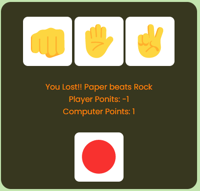

<h1 align="center"> Rock Paper Scissor / Pedra Papel Tesoura </h1>

Jogo Pedra papel tesoura com tecnologias FrontEnd  
Com a ajuda de <a href='https://www.cleverprogrammer.com/coaching-yt' target='_blank'>Clever Programmer</a>  

  <a href="#-tecnologias">Tecnologias</a>&nbsp;&nbsp;&nbsp;|&nbsp;&nbsp;&nbsp;
  <a href="#-projeto">Projeto</a>&nbsp;&nbsp;&nbsp;|&nbsp;&nbsp;&nbsp;
  <a href="#-layout">Layout</a>&nbsp;&nbsp;&nbsp;|&nbsp;&nbsp;&nbsp;
  <a href="#-licença">Licença</a>

 

  

## Tecnologias

Esse projeto foi desenvolvido com as seguintes tecnologias:

- HTML e CSS
- JavaScript
- Git e Github

## Projeto

Pode experimentar a aplicação no seguinte link <a href='https://nunoncunha.github.io/rock-paper-scissors/' target='_blank'>Rock Paper Scissors</a>
  
O jogador pode fazer a sua escolha carregando nos botões (&#128074; &#9995; &#9996;) de jogo ou pode recomeçar carregando no botão &#128308; 
A cada jogo é apresentado o resultado e os pontos do computador e do jogador. 

## Layout

## Licença
